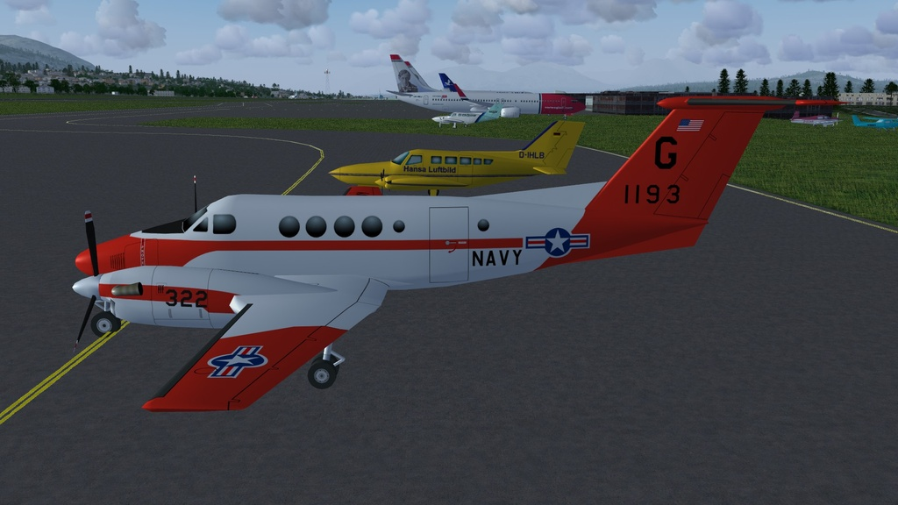

# Beech Super King Air 200
### AI Aircraft for FlightGear
#### Now with navigation lights.

Download the zip file and extract the "beech-200" folder into the "$FG_ROOT/AI/Aircraft" folder.

This AI aircraft is already in FlightGear but this version has navagation lights.

**RAF and US Navy liveries are not currently in FlightGear.**

To use you will need to create a traffic file, see the wiki for instructions. http://wiki.flightgear.org/AI_Traffic

There is a simple AI Traffic Creator here: 
https://github.com/gooneybird47/FlightGear-AI-Traffic-Creator